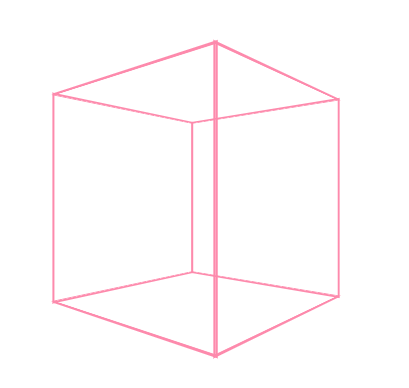
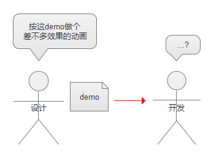
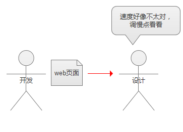
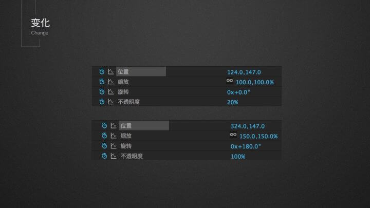
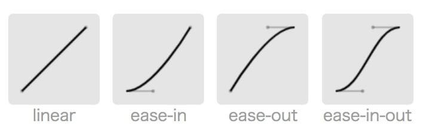
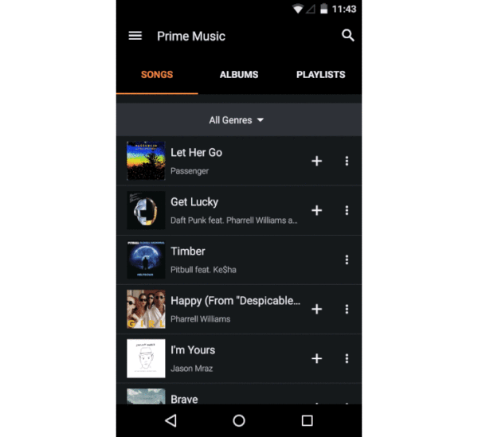
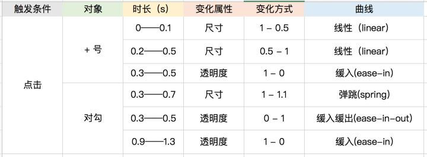
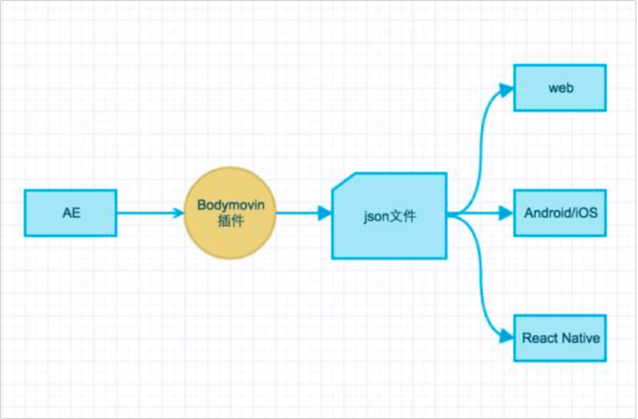

### 实现方法

#### css/js动画库

  如 [Animate.css](https://daneden.github.io/animate.css/)  [Velocity.js](http://www.mrfront.com/docs/velocity.js/index.html)

  * 简单易用
  * 动效有限制

#### 纯代码Css/Js/svg

  
  

  [demo1源码](https://codepen.io/mt_tuanzi/pen/mKyved)  [demo2源码](https://codepen.io/Alireza29675/pen/KwgwMy)

  * 资源占用空间少
  * 复杂图形代码量很大

#### Gif 

  * 不便交互
  * 不能按比例放大匹配大和高密度屏幕


#### 帧动画 

  生成工具：[gka](https://gka.js.org)

  * 资源占用空间大
  * 不能按比例放大匹配大和高密度屏幕

#### 开源库 
  
  如 `Lottie` `Keyframe`，将AE导出的动画资源直接在项目中应用。

  * 降低开发成本
  * 部分AE效果不适用，需设计配合


-----------------------------

### 对接常见问题

#### 动效过多或不合理？ 

  说服设计/需求方：[什么样的动效是好动效](https://zhuanlan.zhihu.com/p/34501702)

#### 沟通困难

  **常见情况**：

  
  

  开发和设计师沟通困难。是因为没有通过精准的参数去描述动效。要解决这个问题，我们需要创造一套有效的对接方案。

  **对接方案**:

  1. 逐帧动画

    开发要求：
      * 加载时间：最低网速环境下加载超过 2s 必须加不超过 5s 的 loading。
      * 移动端流量消耗：移动端非wifi网络下，动画资源限制总大小不超过2M。
      * 通常用户感知流畅帧率为 60fps，为了保证最终效果，一般以20fps做为最低播放帧率。（1s播放30帧 ）
  <br />  

    设计提供：
      * 提供每帧图及其宽高尺寸
      * 每帧图的播放时长，总帧数
      * 动效Demo，gif、MP4等，格式不限
      * 动画触发时机，如：页面加载结束时，某按钮点击时
  <br />

  2. 直接应用AE导出的json文件实现动画

    设计提供：

      * AE导出的文件
      * 动画宽高尺寸
      * 循环次数
      * 页面内位置示意图
      * 触发时机，如：页面加载结束时，某按钮点击时
  <br />

  3. 通过css/js/svg等实现动画

    设计提供：

      * 动画素材
      * 动效标注
    <br/>

    > 有效的动效标注：让设计师可以轻松地描述动效，让开发可以准确地还原动效。

    设计们并不一定清楚开发所需要的数据，所以开发需要简单了解下动效相关原理：

    无论多复杂的动效都由三个元素经过组合拼接出来：变化、时长、曲线

    a. 变化
      
      * 位移
      * 旋转
      * 尺寸
      * 透明度

      这四类变化基本涵盖了界面元素的全部运动方式。

      AE制作的动画：

      

      前后参数变化：

      

    b. 时长

      动画播放的时间长度，需要确定每一段变化的时间

    c. 曲线

      曲线描述的是物体运动时候的速度变化，动效设计中，曲线也是设计者最为关注的部分。

      最基础的速度曲线：
      
        * 线性（就是全程匀速）
        * 缓入
        * 缓出
        * 缓入缓出

      

      实际的使用场景中（设计个人感官），基础的速度曲线不一定能满足动画效果。

      设计软件（以AE为例）中可以通过值图表来调整整个动画的曲线，并通过换算方法/插件/工具得到可用于开发的cubic-bezier曲线参数。

      ```css
      div {
        transition: all 500ms cubic-bezier(0.10, 0.45, 0.46, 0.99); 
      }
      ```

      `cubic-bezier(n, n, n, n)` 值是 0 至 1 之间的数值。
      
      在线调试、实时预览cubic-bezier曲线参数：

        * [http://cubic-bezier.com](http://cubic-bezier.com/)
        * [http://www.css3beziercurve.net/](http://www.css3beziercurve.net/)
      <br/>

    标注实例：

      
      
      标注的时候除了说明**动效的三元素**、还要说明**触发条件**以及**动画对象**、所以最好用表格的方式、这样可以更清晰的把它们每一段变化都清晰罗列出来

      

----------------------------

### lottie

#### 简介

  

  Lottie是Airbnb开源的一个支持web、Android、iOS 以及 ReactNative，利用json文件的方式快速实现动画效果的库。

  

  `Bodymovin` 将 AE 中制作好的动画导出成一个 json 文件，`Lottie` 实现了各平台对该 json 文件的解析和渲染。
  
  * web 端项目GitHub：[lottie-web](https://github.com/airbnb/lottie-web)
  * json 在线预览：[官方预览地址](https://www.lottiefiles.com/preview)

#### 具体使用看GitHub ↑↑↑

#### 优点

  1. 动画还原度高，开发成本低
  2. 可通过API控制动画进度、播放、暂停等。
  3. 动画没有使用Mask/mattes(遮罩/蒙版)效果的时候内存占用少。
  4. 相对于其他实现方案而言，这个方案更为轻量，性能和存储上更佳。

#### 存在问题

  1. 只支持 AE 动画
  2. 部分 AE 效果无法成功通过 Bodymovin 插件导出，[官方AE功能支持文档](http://airbnb.io/lottie/supported-features.html)
  3. masks/mattes(遮罩/蒙版) 动画需要额外的 Bitmap 辅助，较为耗费性能
  4. 库占用资源不小，最轻量的版本webpack打包后占143kb

#### 开发中遇到的坑

  1. import 默认引入完整未压缩版lottie.js。

    **解决方案：**
    * 通过路径引入文件 `lottie-web/build/player/**.js`

    * 配置打包工具，根据环境选择性引入

      ```bash
      // webpack
      // lottie_light.js 不含canvas，只能使用svg

      resolve: {
        alias: {
          lottie: process.env.NODE_ENV === 'production'
            ? 'lottie-web/build/player/lottie_light.min.js'
            : 'lottie-web/build/player/lottie_light.js',
        },
      },
      ```

  2. 动画内引用图片资源，使用动画过程中会出现图片404问题。
  
    **原因：**
      * AE导出的文件包含一个images文件夹及一个data.json文件。JSON内图片引用使用相对路径`/images`，
      <br/>

    **解决方案:**
    * 手动改json内路径（应急方案/不建议）
      <br/>

  3. 不确定json文件有效性

    **解决方案：**
    * 在线预览：[官方预览地址](https://www.lottiefiles.com/preview)

---------------------

### 参考资料

* [最全最好用的动效落地方法、都帮你总结好了（上）](https://zhuanlan.zhihu.com/p/34501702)
* [最全最好用的动效落地方法、都帮你总结好了（下）](https://zhuanlan.zhihu.com/p/34815524)
* [如何看待 Airbnb 新发布的 Lottie？](https://www.zhihu.com/question/55315505)
* [2018IFE设计师学院](http://ife.baidu.com/college/detail/id/8)